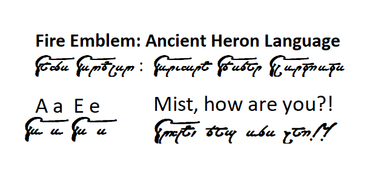
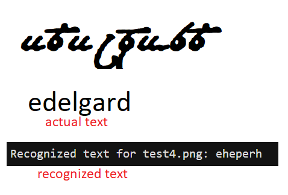

# heron-ocr

## Notes on this project and the Heron Language!

- The Heron Language is a script used in the videogames Fire Emblem 9 and Fire Emblem 10 in which each symbol corresponds to an English alphabet letter. Since these characters are obviously not unicode, we use Tesseract to identify them as icons/symbols that we correspond to an unicode character.

- The model doesn't work well de facto, but I believe with a lot more input data (images and boxes) it could start working better and better. It is just a fun experience with Tesseract to recognize this language. I label images manually using jTessBoxEditor:

  

- Some particular challenges beyond the cursive style for the script would include the particular way of capitalizing letters, and some odd similarities between some characters like the "a" being simply a slightly longer "e", as shown below.

  

- Its results are currently bad, but it does seem to recognize some characters and has slightly better results in specific words it has been trained with before.

  

- The full trained data (in heron_language) should be inside the tessdata folder on the tesseract-OCR installdir. Make sure to alter your environment variables if you have any trouble during the OCR process (environment variables > system variables > edit - Name: TESSDATA_PREFIX Value: directory where trainingfile is located, in this case should be ../tessdata/heron_language). You can also just copy paste all the files to the tessdata directory directly. Just make sure your environment/system variable is set to the correct directory.

- Please see the resources and extra notes below.

```bash
python main.py
```

## How to produce trained data

### 1. Annotating the script

- For making a training file you need to have an image (jpg, tiff, png) of sample text. (Like the ones in images)
- Generate a box file for each of these images with:

```bash
tesseract own.std.exp0.jpg own.std.exp0 makebox
tesseract [name_of_image_for_label.extension] [name_of_box_file_equal] makebox
```

- Open jTessBoxEditor > Box Editor > Open image file and then start anotating it. This needs to be manual because the script is not unicode, so we map the symbols to unicode versions (which in this case correspond to the letters of the english alphabet).

- Save when done.

- Don't forget, for each image you should have a corresponding box file! As you label the images the coordinates of each symbol will be saved in the box file, and as such you should create this box file as per the previous step always. You won't be able to label using jTessBoxEditor otherwise.

### 2. Creating the training data

- After you annotate all the data you need, you can use jTessBoxEditor to produce the trained data for you.

- Open jTessBoxEditor > Trainer

- The Tesseract executable should be the directory where you installed Tesseract, and the Training data should be the directory where you have ALL your annotated images (and corresponding box files!!)

- Select "heron_language" as the language (or another name) and "Train with existing box".

- Click on Run and the output should all be on the folder you have all your annotated images in (note that a lot of files were created as well as a folder called "tessdata" with the traineddata file. This is the most important, but you should save all. All of these are on the heron_language folder here).

## Useful Resources + Notes

- Resources I consulted to make this:

1. Train Tesseract to label icons: [here](https://stackoverflow.com/questions/57995023/train-tesseract-to-label-icons)
2. Extra Info on training Tesseract (manually): [here](https://medium.com/apegroup-texts/training-tesseract-for-labels-receipts-and-such-690f452e8f79) I recommend using JTessBox instead as described above if trouble arise (my case).

- Important:

1. The font I used to get the images in the Heron script the first place is available on the heron_font folder, and I got it from here: [SerenesForest](https://serenesforest.net/path-of-radiance/miscellaneous/ancient-language/) I used the one by Darkspawn980. Thanks!
2. To install all needed dependencies:
```bash
pip install pytesseract pillow opencv-python numpy
```
